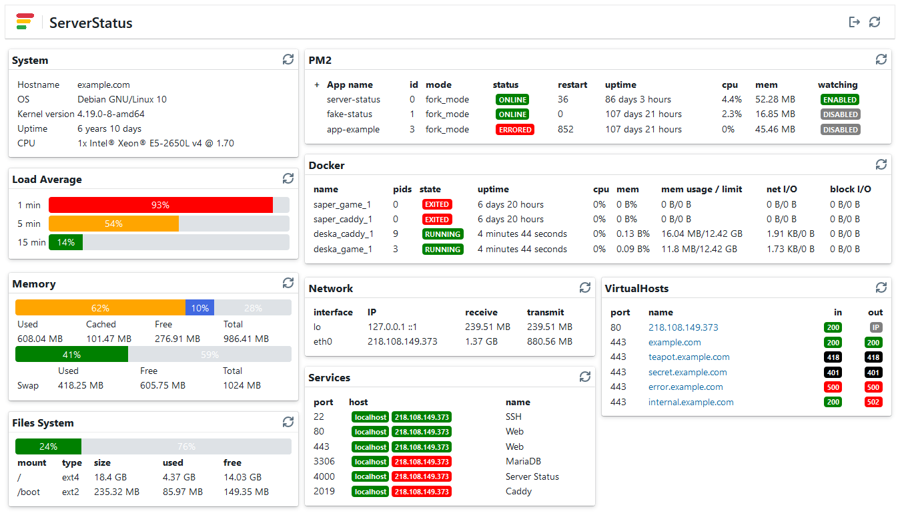

# Server Status App

Frontend app for [`@server-status/api`](https://gitlab.com/adam-zielonka-pro/server-status/-/tree/main/api)



## Build

Default endpoint is '/api/', if you want to use different use env `REACT_APP_API_URL`.
You can use in `.env` file:
```env
REACT_APP_API_URL=https://server.example.com/api/
```
Or you can use in terminal:
```bash
$ REACT_APP_API_URL=https://server.example.com/api/ yarn build
```

## License
MIT
